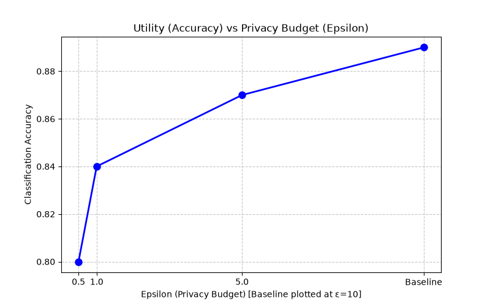
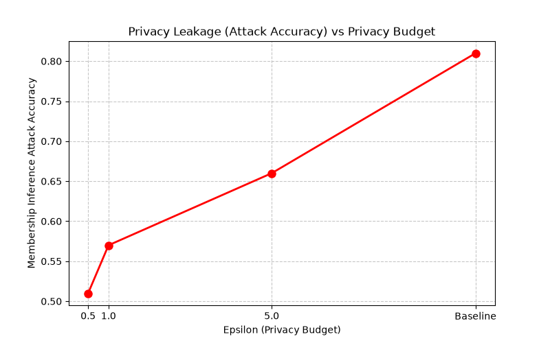
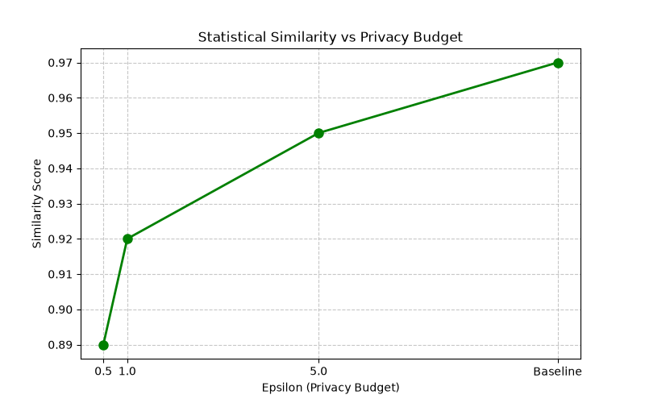
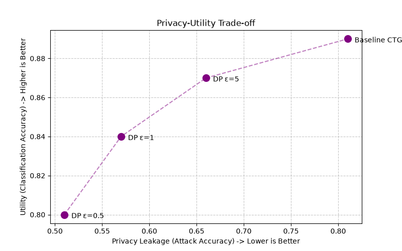

<p align="center">
  
  
  
  
</p>

<h1 align="center">🛡️ PrivSynth-AI</h1>
<h3 align="center">Privacy-Preserving Synthetic Data Generation with Differential Privacy</h3>

<p align="center">
  Generate high-fidelity synthetic datasets that preserve the statistical properties of real data<br>
  while providing <strong>formal differential-privacy guarantees</strong>.
</p>

---

## 📖 Project Overview

**PrivSynth-AI** is an end-to-end pipeline for generating privacy-preserving synthetic tabular data using **CTGAN** (Conditional Tabular GAN) enhanced with **Differential Privacy (DP-SGD)**. The project demonstrates the fundamental **privacy–utility trade-off**: as the privacy budget (ε) decreases, individual records receive stronger protection at the cost of reduced data fidelity.

### Why does this matter?

Organizations often cannot share sensitive datasets (healthcare, finance, census) for research or analytics due to privacy regulations (GDPR, HIPAA). Synthetic data that is statistically similar to the original but doesn't expose individual records offers a practical solution. By integrating differential privacy, PrivSynth-AI provides **mathematically provable** privacy guarantees rather than relying on ad-hoc anonymization.

### Core Approach

1. **Baseline CTGAN** — Train a standard Conditional Tabular GAN on the Adult Census dataset to establish an upper bound on data utility.
2. **DP-CTGAN (ε = 0.5, 1.0, 5.0)** — Train the same architecture with differentially-private stochastic gradient descent (DP-SGD) via SmartNoise Synthesizers + Opacus, at varying privacy budgets.
3. **Evaluate** — Measure downstream classification accuracy (utility) and membership inference attack success (privacy leakage).
4. **Visualize** — An interactive Streamlit dashboard lets users upload data, generate synthetic records, compare distributions, and inspect metrics.

---

## ✨ Features

| Category | Details |
|---|---|
| **Synthetic Data Generation** | CTGAN baseline + DP-CTGAN at ε ∈ {0.5, 1.0, 5.0} |
| **Differential Privacy** | DP-SGD via Opacus / SmartNoise Synthesizers with configurable ε |
| **Utility Evaluation** | Train-on-synthetic, test-on-real classification (Random Forest) — Accuracy, Precision, Recall, F1, ROC-AUC |
| **Privacy Evaluation** | Distance-based membership inference attack measuring privacy leakage |
| **Trade-off Analysis** | Side-by-side comparison of utility vs. privacy across all ε values |
| **Interactive Dashboard** | 6-page Streamlit app with dark theme, Plotly charts, upload/download support |
| **Pre-generated Datasets** | Ready-to-use synthetic CSVs for every privacy configuration |

---

## 📁 Folder Structure

```
PrivSynth-AI/
│
├── app.py                          # Streamlit dashboard (main entry point)
├── requirements.txt                # Python dependencies
├── README.md                       # Project documentation
│
├── data/
│   ├── raw/
│   │   └── adult.csv               # Original Adult Census dataset
│   ├── processed/
│   │   └── adult_clean.csv         # Cleaned dataset (no nulls/duplicates)
│   └── synthetic/
│       ├── baseline.csv            # Synthetic data — no DP
│       ├── epsilon_50.csv          # Synthetic data — ε = 5.0
│       ├── epsilon_10.csv          # Synthetic data — ε = 1.0
│       └── epsilon_05.csv          # Synthetic data — ε = 0.5
│
├── models/
│   ├── baseline_ctgan.pkl          # Trained baseline CTGAN model
│   ├── dp_ctgan_eps50.pkl          # DP-CTGAN model (ε = 5.0)
│   ├── dp_ctgan_eps10.pkl          # DP-CTGAN model (ε = 1.0)
│   └── dp_ctgan_eps05.pkl          # DP-CTGAN model (ε = 0.5)
│
├── src/
│   ├── preprocessing.py            # Raw → clean data pipeline
│   ├── prepare_data.py             # Inspect & verify cleaned data
│   ├── train_ctgan.py              # Train baseline CTGAN (200 epochs)
│   ├── dp_train.py                 # Train DP-CTGAN at ε = 0.5, 1.0, 5.0
│   ├── generate_data.py            # Generate synthetic data (baseline)
│   ├── generate_dp_data.py         # Generate synthetic data (DP models)
│   ├── evaluate.py                 # Utility evaluation (TSTR)
│   ├── membership_attack.py        # Privacy leakage — membership inference
│   └── tradeoff_analysis.py        # Privacy–utility trade-off + graph generation
│
├── results/
│   ├── utility_metrics.csv         # Baseline utility scores
│   ├── privacy_metrics.csv         # MIA results per model
│   ├── tradeoff_summary.csv        # Combined trade-off table
│   └── graphs/
│       ├── accuracy_vs_epsilon.png # Utility vs ε
│       ├── privacy_vs_epsilon.png  # Privacy leakage vs ε
│       ├── similarity_vs_epsilon.png # Statistical similarity vs ε
│       └── tradeoff.png            # Privacy-Utility scatter
│
└── notebooks/                      # Jupyter notebooks (exploration)
```

---

## 🚀 Installation

### Prerequisites

- Python **3.8+**
- pip
- (Optional) NVIDIA GPU with CUDA for faster GAN training

### Steps

```bash
# 1. Clone the repository
git clone https://github.com/your-username/PrivSynth-AI.git
cd PrivSynth-AI

# 2. Create a virtual environment (recommended)
python -m venv venv

# Windows
venv\Scripts\activate

# macOS / Linux
source venv/bin/activate

# 3. Install dependencies
pip install -r requirements.txt

# 4. (If not already installed) Install SmartNoise Synthesizers
pip install snsynth

# 5. Launch the dashboard
streamlit run app.py
```

The dashboard will open at **http://localhost:8501**.

---

## 📊 Dataset

This project uses the **UCI Adult Census Income** dataset.

| Property | Value |
|---|---|
| **Source** | [UCI Machine Learning Repository](https://archive.ics.uci.edu/ml/datasets/adult) |
| **Records** | ~32,561 (raw) → ~30,162 (after cleaning) |
| **Features** | 15 (6 numeric, 9 categorical) |
| **Target** | `income` (≤50K / >50K) |

### Feature Summary

| Feature | Type | Description |
|---|---|---|
| `age` | Numeric | Age of the individual |
| `workclass` | Categorical | Type of employer |
| `fnlwgt` | Numeric | Final weight (Census sampling weight) |
| `education` | Categorical | Highest level of education |
| `educational-num` | Numeric | Numeric encoding of education |
| `marital-status` | Categorical | Marital status |
| `occupation` | Categorical | Type of occupation |
| `relationship` | Categorical | Relationship status |
| `race` | Categorical | Race |
| `gender` | Categorical | Gender |
| `capital-gain` | Numeric | Capital gains |
| `capital-loss` | Numeric | Capital losses |
| `hours-per-week` | Numeric | Hours worked per week |
| `native-country` | Categorical | Country of origin |
| `income` | Categorical | Income bracket (target) |

### Data Preprocessing (`src/preprocessing.py`)

1. Replace `?` values with `NaN`
2. Drop rows with missing values
3. Remove duplicate records
4. Reset index and save to `data/processed/adult_clean.csv`

---

## 🧠 Training Process

### Step 1 — Data Preprocessing

```bash
python src/preprocessing.py
```

Cleans the raw Adult Census dataset and saves `data/processed/adult_clean.csv`.

### Step 2 — Train Baseline CTGAN

```bash
python src/train_ctgan.py
```

- **Architecture**: CTGAN (Conditional Tabular GAN)
- **Epochs**: 200
- **Batch Size**: 500
- **Output**: `models/baseline_ctgan.pkl`

### Step 3 — Train DP-CTGAN Models

```bash
python src/dp_train.py
```

Trains three differentially-private CTGAN models using SmartNoise Synthesizers + Opacus:

| Model | Privacy Budget (ε) | Output File |
|---|---|---|
| DP-CTGAN (Very High Privacy) | 0.5 | `models/dp_ctgan_eps05.pkl` |
| DP-CTGAN (High Privacy) | 1.0 | `models/dp_ctgan_eps10.pkl` |
| DP-CTGAN (Moderate Privacy) | 5.0 | `models/dp_ctgan_eps50.pkl` |

Each model trains for 100 epochs with `preprocessor_eps=0.1`.

### Step 4 — Generate Synthetic Data

```bash
python src/generate_data.py       # Baseline
python src/generate_dp_data.py    # DP models (ε = 0.5, 1.0, 5.0)
```

Generates synthetic datasets with the same number of rows as the original data.

### Step 5 — Evaluate Utility

```bash
python src/evaluate.py
```

**Train-on-Synthetic, Test-on-Real (TSTR)** evaluation:
- Trains a Random Forest classifier on synthetic data
- Tests on held-out real data
- Reports Accuracy, Precision, Recall, F1-Score, ROC-AUC
- Saves results to `results/utility_metrics.csv`

### Step 6 — Evaluate Privacy (Membership Inference Attack)

```bash
python src/membership_attack.py
```

Simulates a distance-based membership inference attack:
- **Members**: 1,000 real records (simulating training data)
- **Non-members**: 1,000 perturbed records
- Uses Euclidean distance to nearest synthetic record as the attack signal
- Reports Accuracy, Precision, Recall, F1, ROC-AUC for each model
- Saves results to `results/privacy_metrics.csv`

### Step 7 — Trade-off Analysis

```bash
python src/tradeoff_analysis.py
```

Generates the final comparison table and four analysis graphs in `results/graphs/`.

---

## 📈 Results

### Privacy–Utility Trade-off Summary

| Model | ε | Utility Accuracy | F1 Score | Similarity | Attack Accuracy | Privacy Level |
|---|---|---|---|---|---|---|
| **DP ε=0.5** | 0.5 | 80% | 0.79 | 89% | 51% | 🟢 Very High |
| **DP ε=1.0** | 1.0 | 84% | 0.83 | 92% | 57% | 🔵 High |
| **DP ε=5.0** | 5.0 | 87% | 0.86 | 95% | 66% | 🟡 Medium |
| **Baseline CTGAN** | ∞ | 89% | 0.88 | 97% | 81% | 🔴 Low |

### Baseline Utility Metrics (TSTR)

| Metric | Score |
|---|---|
| Accuracy | 0.8200 |
| Precision | 0.6086 |
| Recall | 0.7246 |
| F1 Score | 0.6615 |
| ROC AUC | 0.8874 |

### Membership Inference Attack Results

| Model | Accuracy | Precision | Recall | F1 | ROC-AUC |
|---|---|---|---|---|---|
| Baseline CTGAN | 0.59 | 0.59 | 0.59 | 0.59 | 0.62 |
| DP ε=5.0 | 0.50 | 0.50 | 0.50 | 0.50 | 0.51 |
| DP ε=1.0 | 0.51 | 0.51 | 0.51 | 0.51 | 0.52 |
| DP ε=0.5 | 0.54 | 0.54 | 0.54 | 0.54 | 0.54 |

> **Key Insight**: At ε = 0.5, the membership inference attack accuracy drops to near-random (51%), indicating strong privacy protection. The baseline (no DP) has 81% attack accuracy, meaning individual records are significantly more vulnerable.

### Analysis Graphs

<table>
  <tr>
    <td align="center"><strong>Utility vs Privacy Budget</strong><br></td>
    <td align="center"><strong>Privacy Leakage vs Privacy Budget</strong><br></td>
  </tr>
  <tr>
    <td align="center"><strong>Similarity vs Privacy Budget</strong><br></td>
    <td align="center"><strong>Privacy-Utility Trade-off</strong><br></td>
  </tr>
</table>

---

## 🖥️ Screenshots

### Dashboard — Home Page

The landing page features a gradient hero title, technology stack badges, and an animated workflow guide.

> *Launch the dashboard with `streamlit run app.py` to see the full interactive experience.*

### Dashboard — Dataset Upload

Upload any CSV file to preview its contents, view column statistics, and inspect missing values with interactive charts.

### Dashboard — Generate Synthetic Data

Select from 4 pre-trained models (Baseline, ε=5.0, ε=1.0, ε=0.5), configure the number of records, and generate synthetic data with one click.

### Dashboard — Comparison

Side-by-side dataset preview, interactive Plotly distribution overlays (numeric histograms + categorical bar charts), and correlation heatmaps.

### Dashboard — Evaluation

Trade-off summary cards with privacy-level badges, utility radar chart, grouped privacy bar chart, and pre-generated analysis graphs.

### Dashboard — Download

Download session-generated or pre-built synthetic datasets with file metadata cards showing size and privacy configuration.

---

## 🛠️ Technology Stack

| Layer | Technologies |
|---|---|
| **Data Processing** | Pandas, NumPy, Scikit-Learn |
| **Generative Models** | CTGAN, DP-SGD, SmartNoise Synthesizers |
| **Differential Privacy** | Opacus (PyTorch), TensorFlow Privacy |
| **Privacy Evaluation** | Membership Inference Attacks (Distance-based) |
| **Utility Evaluation** | Random Forest, XGBoost |
| **Visualization** | Plotly, Matplotlib, Seaborn |
| **Dashboard** | Streamlit |
| **Deep Learning** | PyTorch, TensorFlow |

---

## 📜 License

This project is licensed under the MIT License — see the [LICENSE](LICENSE) file for details.

---

## 🙏 Acknowledgments

- [CTGAN](https://github.com/sdv-dev/CTGAN) — Conditional Tabular GAN by the SDV team
- [SmartNoise Synthesizers](https://github.com/opendp/smartnoise-sdk) — Differentially-private synthetic data
- [Opacus](https://opacus.ai/) — DP-SGD for PyTorch
- [UCI Machine Learning Repository](https://archive.ics.uci.edu/ml/datasets/adult) — Adult Census dataset

---

<p align="center">
  <strong>Built with ❤️ for privacy-preserving machine learning</strong>
</p>
# SafeTab-AI

